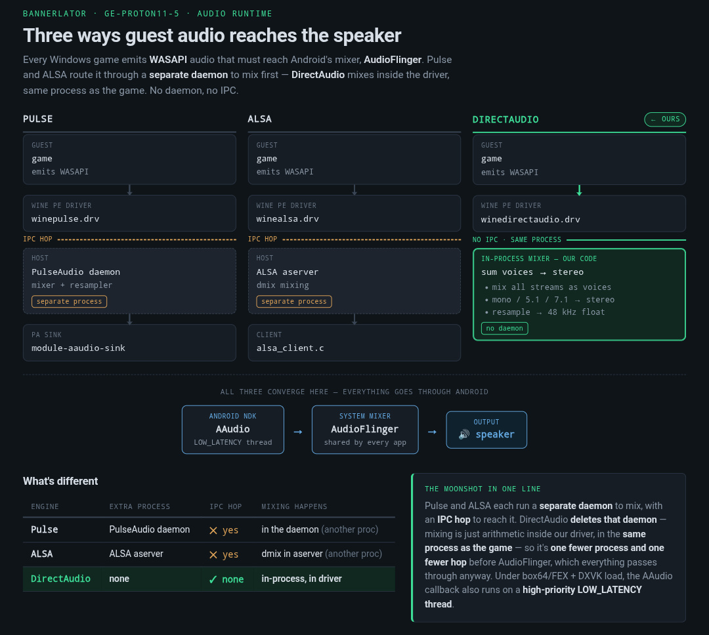

# DirectAudio

**Native Wine → Android AAudio audio driver.** A Wine [`mmdevapi`](https://gitlab.winehq.org/wine/wine/-/tree/master/dlls/mmdevapi) backend (`winedirectaudio.drv`) that carries guest **WASAPI** audio straight to Android **AAudio** — **no PulseAudio daemon and no ALSA server** in the path. All per-stream mixing happens **in-process, inside the driver**, so there's one fewer process and one fewer IPC hop before Android's own mixer (AudioFlinger), which every app goes through anyway.



```
game (guest WASAPI) → winedirectaudio.drv → in-process mixer → AAudio → AudioFlinger → 🔊
                                            (sum voices, mono/5.1/7.1 → stereo, resample → 48 kHz)
```

For comparison, the alternatives cross a Unix socket into a second process first:

```
PulseAudio  game → winepulse.drv → libpulse ──socket──► PA daemon → module-aaudio-sink → AAudio
ALSA        game → winealsa.drv  → alsa-lib ──socket──► Java server → JNI client        → AAudio
DirectAudio game → winedirectaudio.drv → in-process mixer ─────────────────────────────► AAudio
```

## Status

Device-proven, shipping. Current release **v1.3.1**. Output: 48 kHz · float · stereo.

---

## Latency

The number that matters is **track latency** — what a player actually hears. It is the driver's buffer plus a fixed Android cost:

```
     buffer   DirectAudio's AAudio buffer   (tunable — this is the part we control)
+  21.00 ms   Android mixer + HAL           (fixed; every app pays it, native ones too)
= track latency
```

**21 ms is a hard floor.** No application on Android can go below it, so a "4 ms" figure quoted anywhere is a *buffer size*, not the delay you hear.

### What it ships as

With no host configuration the driver asks AAudio for `LOW_LATENCY` with adaptive buffering and decay enabled, and opens at a 12 ms buffer — **33 ms total** on the reference device, since AudioFlinger adds 21 ms of its own. Hosts normally override this with a preset. Measured on the reference device (Adreno 750, Android 14, 192-frame burst):

| requested buffer | track latency |
|---|---|
| 192 fr · 4 ms *(one burst — the hardware floor)* | **25.00 ms** |
| 384 fr · 8 ms | 29.00 ms |
| 1248 fr · 26 ms | 45.00 ms |
| 3000 fr · 62.5 ms | 83.50 ms |

For reference, PulseAudio's common default (`PULSE_LATENCY_MSEC=100`) works out to roughly **121 ms** on the same device.

### Seven games at a 4 ms request

All measured live during gameplay, zero underruns:

| game | graphics | audio API | buffer | track latency |
|---|---|---|---|---|
| Insane 2 | D3D9 | FAudio | 4 ms | **25.00 ms** |
| GTA V Enhanced | D3D12 / VKD3D | WASAPI | 4 ms | **25.00 ms** |
| DiRT Showdown | D3D11 | WASAPI | 4 ms | **25.00 ms** |
| Hades | D3D11 | FAudio | 4 ms | **25.00 ms** |
| GTA IV | D3D9 | DirectSound | 4 ms | **25.00 ms** |
| God of War | D3D11 | FAudio / XAudio2 | 8 ms | 29.00 ms |
| DiRT 3 | D3D11 | WASAPI | 12 ms | 33.00 ms |

The last two could not sustain 4 ms and **found their own floor** — see below.

---

## Adaptive buffering

A fixed buffer is the wrong shape for this problem. Too small and a game under box64/FEX + DXVK crackles the moment a GPU submission stalls; too large and everything is needlessly late. DirectAudio starts at the requested size and **grows only in response to real underruns**, one burst at a time, up to the growth ceiling (100 ms by default):

- **Reclaims when calm.** Growth used to be one-way, so a single loading screen taxed latency for the whole session. After 10 s with no underrun the engine gives one burst back and sees if it holds. Naive shrinking oscillates — shrink, underrun, grow, shrink — and each cycle is an audible click, which is why Google's Oboe `LatencyTuner` refuses to shrink at all; two guards make it safe here. **It never goes below the size the stream opened at**, so it can only undo growth, never undercut the launch config. And an underrun within 5 s of a step down marks that level unsustainable for this title: the engine stops probing below it and doubles its patience, up to ~5 minutes. A game that genuinely needs headroom settles after a probe or two instead of clicking forever.
- **Edge-triggered.** It reacts to a *rise* in AAudio's xrun counter, not its absolute value, so one bad moment during level loading doesn't permanently inflate the buffer.
- **Suspension-aware.** While the guest is frozen (app backgrounded) the xrun counter climbs regardless — that is not timing pressure. The engine re-baselines instead of growing, so background/foreground cycles don't ratchet latency upward.
- **Free.** A couple of integer comparisons per callback, on the audio thread.

In practice this means the driver converges on the lowest buffer each title can actually hold. Five of the seven games above sat on the hardware floor; God of War (the heaviest CPU load in the set) settled at 8 ms and DiRT 3 at 12 ms — all three with **zero underruns**.

Set `BANNER_AUDIO_DIRECT_ADAPTIVE=0` to pin the buffer instead. Only do this if you are chasing a fixed minimum and accept crackle when a title can't hold it.

---

## Self-healing

An AAudio stream can die in ways it never recovers from, and a disconnected or disabled stream **can never be restarted** — it has to be rebuilt. DirectAudio detects and rebuilds automatically in three cases:

| trigger | how it's detected | what happens |
|---|---|---|
| **Output route change** (headphones, Bluetooth, HDMI, USB) | AAudio error callback — `DISCONNECTED`, `INVALID_STATE`, `INVALID_HANDLE`, `TIMEOUT` | stream rebuilt on the new route |
| **Stalled data callback** (after a background/foreground cycle starves the stream and AudioTrack disables itself — raises *no* error) | watchdog on the timer loop: callback silent 1 s while audio is playing | stream rebuilt |
| **Teardown deadlock** (a game creates, starts and releases a transient stream during init) | bounded 500 ms timer-thread join | stream leaked rather than hanging the game |

**Recovery is inaudible.** The replacement stream is opened and promoted *before* the old one is destroyed — a ~77 ms swap that the guest's ring buffer covers. In testing, five rebuilds occurred during heavy background/foreground abuse and none were heard.

Rebuilds are logged in the **release** build, so a field report is self-diagnosing:

```
I DirectAudio: reopen: data callback stalled
I DirectAudio: reopen: stream error
```

This is event-level only — a handful of lines per session. Per-callback heartbeats live in the separate diagnostics build.

---

## Compatibility

**Requires Wine 11.** The `mmdevapi` unixlib vtable is index-based and Wine 11 inserted `midi_get_driver` at slot 30, shifting every later slot. Wine 10's `mmdevapi` has no MIDI dispatch at all. **A single build cannot span Proton 10 and 11** — build per Wine major version. (arm64ec vs x86_64 is only a compile target, not an ABI split.)

**MIDI is delegated to `winealsa.drv`**, exactly as `winepulse.drv` does. It loads as a dormant library in the game's own process — no daemon, no extra process, and no audio passes through it. If winealsa is unavailable, MIDI is simply absent and audio is unaffected.

**Verified:** D3D9 / D3D11 / D3D12+VKD3D, and WASAPI / FAudio / XAudio2 / DirectSound. Tested on a single device (Adreno 750, Android 14) — **Mali GPUs are untested**.

**Not yet supported:** microphone capture, true multichannel output (everything is downmixed to stereo).

### Configuration

#### What it ships with

With no host configuration at all, every value below is what the driver uses:

| | shipped default | total latency |
|---|---|---|
| **buffer** | **12 ms** (`DA_DEFAULT_MS`, rounded up to a burst) | **33 ms** |
| growth ceiling | 100 ms | 121 ms worst case |
| performance mode | `LOW_LATENCY` | |
| adaptive growth | on | |
| decay (reclaim when calm) | on | |
| device period | 10 ms (min 5 ms) | |
| sharing mode | `SHARED` | |
| callback watchdog | on, 1 s | |
| verbose logging | off | |

**Every latency figure in this README is a total** — the driver's buffer plus
Android's fixed 21 ms. A "12 ms buffer" is 33 ms of delay to the ear. The env
vars below are all set in **buffer** milliseconds, so `_MS=12` means 33 ms total.

> **Release note.** The 12 ms / 33 ms default, adaptive decay, and the millisecond
> knobs shipped in **v1.2.2** and are current in **v1.3.0**. (Releases before v1.2.2
> opened at a 62.5 ms buffer — **83 ms total** — with no decay and no ms knobs.)
> Hosts that set `_BF` from a preset — Bannerlator does — override the default
> either way.

#### Environment variables

Read from the environment; per-stream knobs at stream open, the rest at process
attach:

| variable | meaning |
|---|---|
| `BANNER_AUDIO_DIRECT_PERF` | `0` NONE · `1` LOW_LATENCY *(default)* · `2` POWER_SAVING |
| `BANNER_AUDIO_DIRECT_ADAPTIVE` | `1` adaptive growth *(default)* · `0` fixed buffer |
| `BANNER_AUDIO_DIRECT_DECAY` | `1` reclaim latency when calm *(default)* · `0` grow-only |
| `BANNER_AUDIO_DIRECT_BF` | initial buffer in frames (`0` = use the shipped default) |
| `BANNER_AUDIO_DIRECT_MBF` | growth ceiling in frames (`0` = use the shipped default) |
| `BANNER_AUDIO_DIRECT_MS` | initial buffer in **milliseconds** *(default 12 → 33 ms total)* — wins over `_BF` |
| `BANNER_AUDIO_DIRECT_MAXMS` | growth ceiling in **milliseconds** *(default 100)* — wins over `_MBF` |
| `BANNER_AUDIO_DIRECT_PERIOD_MS` | device period reported to the guest *(default 10)* |
| `BANNER_AUDIO_DIRECT_MINPERIOD_MS` | minimum period reported to the guest *(default 5)* |
| `BANNER_AUDIO_DIRECT_EXCLUSIVE` | `1` request an EXCLUSIVE AAudio stream · `0` SHARED *(default)* |
| `BANNER_AUDIO_DIRECT_WATCHDOG` | `1` dead-callback watchdog *(default)* · `0` off |
| `BANNER_AUDIO_DIRECT_STALL_MS` | callback silence before a rebuild *(default 1000)* |
| `BANNER_AUDIO_DIRECT_DECAY_QUIET_MS` | calm required before a step down *(default 10000)* |
| `BANNER_AUDIO_DIRECT_DECAY_PUNISH_MS` | window in which an underrun blames the last step *(default 5000)* |
| `BANNER_AUDIO_DIRECT_DECAY_MAXBACKOFF` | cap on the quiet-period multiplier *(default 32)* |
| `BANNER_AUDIO_DIRECT_LOG` | `1` verbose logcat on a **release** build *(default 0)* |
| `BANNER_AUDIO_DIRECT_RUNTIME` | path to a live-config "mailbox" file the host rewrites in-game *(unset = off)* — see below |

Everything is read once — the per-stream knobs at stream open, the period,
watchdog, decay and log settings at process attach (the guest asks for the
device period before it creates anything). Values of `0` or less are ignored
rather than honoured, so a malformed value falls back to the built-in instead of
requesting something degenerate. `_WATCHDOG` is the exception: it is a boolean,
where `0` is a real answer.

#### Setting latency by hand, with no UI

Put this in the game's environment (in Bannerlator: the shortcut's **Environment
Variables** box — per-game, and it survives relaunches):

```
BANNER_AUDIO_DIRECT_MS=8 BANNER_AUDIO_DIRECT_MAXMS=60
```

That is the whole thing. `_MS` is the buffer the stream opens at **and the floor decay returns to** —
the driver never goes below it, so it is a target, not just a starting point.
`_MAXMS` is as far as adaptive may climb when a title needs headroom. **`_MS` deliberately overrides `_BF`** — a host app writes `_BF` from
whichever preset is selected, so a hand-typed frame count is in a fight with the
preset it cannot win. Nothing writes `_MS` but a person.

Two things to expect:

- **The number gets rounded up.** AAudio serves whole bursts, so on a device with
  a 4 ms burst, `_MS=5` becomes 8 ms. The driver rounds up rather than down —
  under-serving a burst just underruns.
- **It is the buffer, not the latency you hear.** Android adds a fixed 21 ms on
  top (more on Bluetooth), so `_MS=8` is **29 ms total** and `_MS=12` is **33 ms**.
  The floor is one burst — 4 ms of buffer, **25 ms total** — and nothing on
  Android goes below it.

Every stream open logs what was actually granted, so there is no guessing:

```
DirectAudio: open: buffer 576 frames (12 ms) burst 192 cap 4800 perf 12 sharing req=0 got=0 period 10 ms - device adds its own output latency
```

`adb logcat -s DirectAudio` shows it, on a release build, with no tracing enabled.

#### The other half of the latency

The buffer knobs above size the **AAudio** side. The **guest** side is the device
period — `get_latency` returns buffer + period, and games size their own buffers
from the period the driver reports. It defaults to 10 ms and is now settable:

```
BANNER_AUDIO_DIRECT_PERIOD_MS=5 BANNER_AUDIO_DIRECT_MINPERIOD_MS=5
```

Lowering it makes the guest write smaller chunks more often. That is a real
latency win and a real CPU cost, and under box64/FEX the cost is not small —
treat it as a per-title experiment, not a default. The minimum is clamped to the
default if you set them inconsistently, since WASAPI does not allow the minimum
period to exceed the default one.

#### Live in-game config (the mailbox)

The driver reads its config from the env at stream open, which means a host UI change would normally need a relaunch. `BANNER_AUDIO_DIRECT_RUNTIME=<path>` opts into live control: it names a flat `KEY=VALUE` file the host rewrites while the game runs. A lazy 1-second watcher thread (off the audio path) `stat`s it and, on change, re-reads and rebuilds the stream from the existing reopen worker — so a setting change lands **without relaunch** (~77 ms swap, inaudible). Keys are `MS` / `MAXMS` (milliseconds) and `PERF` (`0/1/2`, same encoding as `_PERF`); values ≤ 0 or an absent key revert to the launch config. Unset `_RUNTIME` = off, and the driver behaves exactly as before.

```
printf 'MS=8\nPERF=1\n' > "$BANNER_AUDIO_DIRECT_RUNTIME"   # → the running stream reopens at 8 ms, LOW_LATENCY
```

#### Diagnosing without a special build

`BANNER_AUDIO_DIRECT_LOG=1` turns on heartbeats plus buffer growth and decay
steps in a **release** build, tagged `DirectAudio` in logcat. The diagnostics
build is still the place for per-call tracing, but a field report no longer
requires shipping someone a different binary to find out what the buffer did.

The remaining tunables exist for the same reason — every one of them was a
number compiled into the driver, which meant testing a different value cost a
CI build. `_STALL_MS`, `_DECAY_QUIET_MS`, `_DECAY_PUNISH_MS` and
`_DECAY_MAXBACKOFF` move the watchdog and decay timings; `_WATCHDOG=0` takes the
watchdog out of the picture entirely when something needs to be A/B'd against
it. `_EXCLUSIVE=1` asks AAudio for an exclusive stream, which can reach a lower
floor on hardware that grants it — AAudio quietly falls back to shared where it
cannot, so check the open log for what you actually got.

---

## Roadmap

Ordered by value against effort. The governing constraint: **none of these may add a daemon or an IPC hop** — the short route to AAudio is the whole point.

**Shipped in v1.3.0** (three items, one of them straight off this list):

- ✅ **Downmix headroom** — the 5.1 → stereo fold (a correct ITU-style mix, centre and surrounds at −3 dB) used to peak at ~2.41× full scale and hard-clip loud content. It now runs through a **soft-knee limiter**, so surround downmix no longer clips, at no latency cost.
- ✅ **Honest exclusive-mode reporting** — `create_stream` used to register every stream as an ordinary shared mixer voice while still *claiming* EXCLUSIVE support. That claim is gone; the open log now reports the **granted** sharing mode next to the requested one (`sharing req=/got=`), so `_EXCLUSIVE=1` is truthful about what the device actually gave back.
- ✅ **`daprobe`** — a small WASAPI capability-probe `.exe` (built by its own workflow) that reports the three answers a game can get and confuses: **accepted** in shared mode (mmdevapi converts, so nearly everything), **natively openable** in exclusive mode (the honest one), and **rendered** (`GetMixFormat`, currently 48 kHz float stereo). It is the measuring instrument for the surround work below.

Remaining, in order:

| | item | why |
|---|---|---|
| 1 | **Route-change format handling** | A new route can have a different sample rate (Bluetooth is often 44.1 kHz where the speaker is 48) and a very different burst size. The rebuild needs to re-derive the resampler ratio and re-apply adaptive sizing, and coalesce repeated disconnect events. |
| 2 | **Real surround** | Negotiate 6/8 channels and pass through where the device grants it (HDMI, USB DAC). On Android 13+, hand AAudio a real 5.1 stream with a channel mask and let the platform **Spatializer** do binaural rendering on headphones — genuine surround with the DSP cost carried by Android. With headroom now handled, this is the next real audio-quality win. |
| 3 | **Microphone capture** | A second AAudio stream in the `INPUT` direction; the capture half of the vtable is already wired but no capture endpoint is exposed. Opened lazily so single-player titles never pay for it. **This is the one item that could threaten the latency floor** — on some devices an input stream knocks the output off the fast path, so it needs measuring rather than assuming. |

Also wanted: verification on Mali hardware, and a lower preset rung in host apps so the 4 ms buffer is reachable from a UI rather than only by environment variable.

---

## License & attribution

**LGPL-2.1-or-later** (see [`COPYING`](COPYING)). This is not a relicensing choice — the driver derives from and links Wine's LGPL `mmdevapi` internals (`wine/unixlib.h`, `../mmdevapi/unixlib.h`) and is modelled on `winecoreaudio.drv`, so it must remain LGPL.

**Copyright © 2026 The412Banner.** If you copy, modify, use, or distribute this code or any part of it, LGPL-2.1 **requires** you to:
- **keep the copyright notice** in [`directaudio.c`](directaudio.c) intact in every copy and derivative,
- **include the LGPL-2.1 license** ([`COPYING`](COPYING)) with any distribution,
- **make the library source available** and **state your changes** (with dates).

**Requested (courtesy):** projects that ship DirectAudio, in whole or part, are asked to credit it as *"DirectAudio by The412Banner (https://github.com/The412Banner/directaudio)"* in their docs, About screen, or release notes. See [`NOTICE`](NOTICE) and [`AUTHORS`](AUTHORS).

## This repo is a Wine DLL directory

It is **not** a standalone buildable project — a Wine driver is a PE + unixlib pair compiled by Wine's own build system against private Wine headers, and its unixlib ABI is pinned to a specific Wine base. This repo is consumed as a **git submodule** dropped in at `dlls/winedirectaudio.drv/` of a Wine/Proton tree.

### Consuming it (proton-wine or any Wine fork)
```sh
git submodule add https://github.com/The412Banner/directaudio dlls/winedirectaudio.drv
```
Then apply the two small integration deltas that live **outside** this directory and therefore cannot ship in the submodule (see [`INTEGRATION.md`](INTEGRATION.md)):
- `configure.ac` — `--with-aaudio` arg, `aaudio/AAudio.h` detection, and `WINE_CONFIG_MAKEFILE(dlls/winedirectaudio.drv)`.
- `dlls/mmdevapi/main.c` — add `directaudio` to `default_list` (omit to keep it opt-in via the `HKCU\Software\Wine\Drivers` `Audio` registry value).

### Pulling a new version into a consumer
```sh
git -C dlls/winedirectaudio.drv fetch --tags
git -C dlls/winedirectaudio.drv checkout directaudio-v1.3.1   # pin to a tagged, ABI-matched release
git add dlls/winedirectaudio.drv && git commit -m "bump directaudio → v1.3.1"
```
The consumer always builds from a **pinned** driver commit — reproducible, never a moving target.

## ABI pinning — the one hard constraint

Each tagged release is **ABI-matched to a Wine base** (the `mmdevapi` unixlib vtable must match the `mmdevapi.dll` it ships with). Tags are named accordingly, e.g. `directaudio-v1.3.1` · Wine 11.0. New *driver logic* builds fine against the pinned base; a new *Wine base* means re-pinning and rebuilding.

## Contributing

Fork this small repo (no full Proton checkout needed), open a PR against `directaudio.c`. CI compiles the DLL against the pinned Wine base to prove it builds and links the ABI. On-device audio behaviour is verified separately (no audio device in CI). Contributions are LGPL-2.1-or-later; add yourself to `AUTHORS`.
